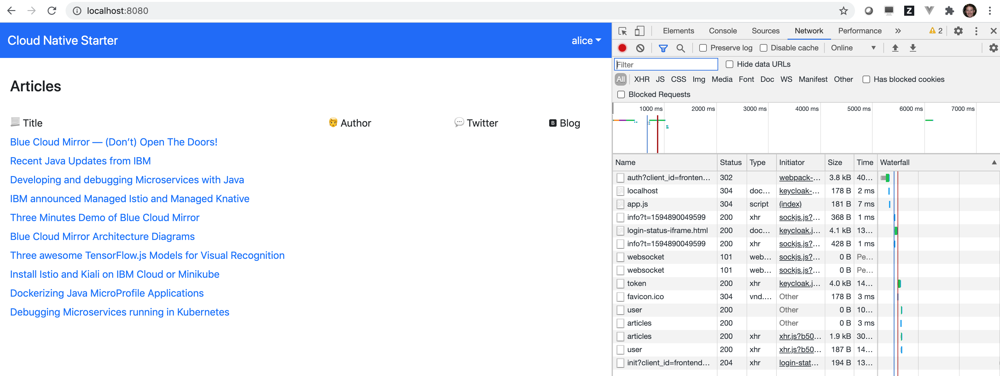
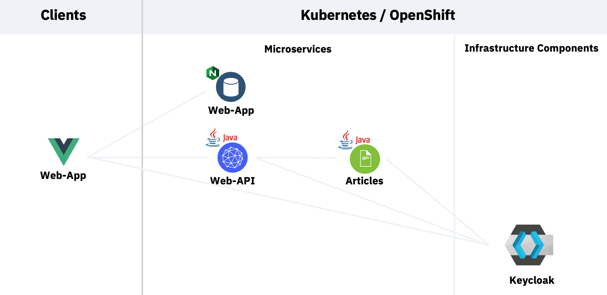

# Overview

_This workshop is an adaptation of the IBM Workshop [Get started with security for your Java Microservices application](https://ibm-developer.gitbook.io/get-started-with-security-for-your-java-microservi/){:target="_blank"}._

_The IBM Workshop depends on preprovisioned Kubernetes clusters on the IBM Cloud based on IBM Cloud Kubernetes Service (IKS) which are not free to use, they incur costs._

_Instead, this version of the workshop is based on [Minikube](https://minikube.sigs.k8s.io/docs/){:target="_blank"} running on your own workstation._

---

In this workshop you will learn how to get started with Application Security from two perspectives:
* Platform security
* Authentication and Authorization implementation

We will show you with an example application:
* How to secure external access to a Kubernetes cluster with TLS
* How to secure communication between Microservices with Istio and mTLS
* How to implement authorization and authentication with the Open Source Identity and Access Management system Keycloak and JSON Web Tokens (JWT)

The exercises are based on an example application based on our Open Source Github project [Cloud Native Starter](https://github.com/IBM/cloud-native-starter/tree/master/security){:target="_blank"}, build with Quarkus and Microprofile

The following screenshot shows the web application, you have to logon to see the list of articles.

<kbd></kbd>

### Architecture

The following diagram shows the architecture of the sample application. There is a Web-App service that serves the Javascript/Vue.js code to the browser. The Web-App code running in the browser invokes a REST API of the Web-API microservice. The Web-API microservice in turn invokes a REST API of the Articles microservice. 

To see the results in the web application, users need to be authenticated and they need to have the role `user`. 

<kbd></kbd>

### Estimated time and level

|  Time | Level  |
| - | - |
| one hour | beginners |

### Objectives

After completion of this workshop, you should understand the following application security related topics:

**Application security provided by the platform**
* [TLS](https://en.wikipedia.org/wiki/Transport_Layer_Security){:target="_blank"}/[HTTPS](https://en.wikipedia.org/wiki/HTTPS){:target="_blank"}
* [mTLS](https://en.wikipedia.org/wiki/Mutual_authentication){:target="_blank"}

**Application security with Keycloak and Quarkus**
* [Authentication with Keycloak](https://en.wikipedia.org/wiki/Authentication){:target="_blank"} on the Web Fronted
* [Authorization in Quarkus](https://en.wikipedia.org/wiki/Authorization){:target="_blank"} for specific Microservices in the backend

*The scope of this workshop is not to explain every aspect of application security.*

### Agenda

These are the sections of this workshop, go through all of them in sequence:

* [1 - Setup the work environment](workshop/01-pre-work/prework.md)
* [2 - Setup Istio](workshop/02-app-env-exercise/SETUP_ISTIO.md)
* [3 - Expose the Istio Ingress gateway via HTTPS/TLS](workshop/02-app-env-exercise/SETUP_ISTIO_INGRESS.md)
* [4 - Setup Keycloak](workshop/02-app-env-exercise/SETUP_KEYCLOAK.md)
* [5 - Deploy the microservices to Kubernetes](workshop/03-p-sec-exercise/01-README.md)
* [6 - Secure microservices with strict mTLS](workshop/03-p-sec-exercise/02-README.md)
* [7 - Istio Authorization](workshop/03-p-sec-exercise/03-README.md)
* [8 - Authentication in the Vue.js fronted](workshop/04-app-sec-exercise/APPLICATION_AUTHENTICATION.md)
* [9 - Authorization in Quarkus application](workshop/04-app-sec-exercise/APPLICATION_AUTHORIZATION.md)

The last section shows how to compile and run the application locally:
* [Setup the web-application and Microservices locally](workshop/04-app-sec-exercise/local.md)

### Compatibility

This workshop has been tested on the following platforms:

* **Minikube**: Version 1.16.0
* **Istio**: Version 1.8.1 

### Technology Used

* [Microservices architecture](https://en.wikipedia.org/wiki/Microservices){:target="_blank"}
* [Keycloak](https://www.keycloak.org){:target="_blank"}
* [Jakarta EE](https://jakarta.ee/){:target="_blank"}
* [MicroProfile](https://microprofile.io/){:target="_blank"}
* [Quarkus](https://quarkus.io/ingress){:target="_blank"}
* [Istio](https://https://istio.io){:target="_blank"}
* [Vue.js](https://vuejs.org/){:target="_blank"}
* [git 2.24.1 or higher](https://git-scm.com/book/en/v2/Getting-Started-Installing-Git){:target="_blank"}
* [yarn 1.22.4 or higher](https://yarnpkg.com){:target="_blank"}
* [Node.js v14.6.0 or higher](https://nodejs.org/en/){:target="_blank"}
* [Apache Maven 3.6.3](https://maven.apache.org/ref/3.6.3/maven-embedder/cli.html){:target="_blank"}

### Credits

* [Niklas Heidloff](https://twitter.com/nheidloff){:target="_blank"}
* [Harald Uebele](https://twitter.com/Harald_U){:target="_blank"}
* [Thomas Südbröcker](https://twitter.com/tsuedbroecker){:target="_blank"}

### Additional resources

[Here](workshop/BLOGS.md) are some blogs that describe how this project has been implemented-

The presentation that goes with this workshop is available [here](images/App-Security-Final-V1-20201006.pdf){:target="_blank"}.
