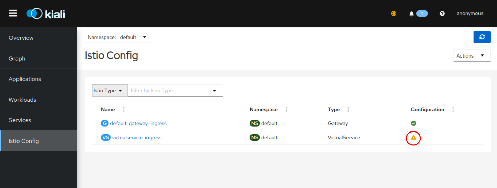

# 3 - Expose the Istio Ingress gateway via HTTPS/TLS

The following procedures have been tested with Minikube. They may partially work with other Kubernetes instances like IBM Cloud Lite Kubernetes Cluster or K3d. 

When you install Istio on a Kubernetes Cluster, the Istio Ingress is created with a Kubernetes service of type LoadBalancer. In a production Kubernetes installation, a LoadBalancer would have a public IP address assigned to it so that it can be reached from the Internet:


Local installations like Minikube typically don't have the ability to do this. Check the Istio Ingress service with the following command:

```
kubectl get svc -n istio-system
```

Output:

```
NAME                   TYPE           CLUSTER-IP       EXTERNAL-IP   PORT(S)                                                                      AGE
istio-ingressgateway   LoadBalancer   10.106.56.168    <pending>     15021:32561/TCP,80:30169/TCP,443:30629/TCP,31400:30606/TCP,15443:32011/TCP   97m
...
```

Notice the type LoadBalancer and the `<pending>` for the external IP address. 

There are NodePorts for HTTP (e.g. 80:30169) and HTTPS (e.g. 443:30629) that can be used to access the Istio Ingress externally together with a Kubernetes workernode IP address (`minikube ip`). 

We will later use a Minikube feature to simulate a LoadBalancer (`minikube tunnel`).

### Step 1: Creating a self-signed certificate

Our Minikube cluster doesn't hava a public IP address and you probably don't own an Internet domain and also don't want to pay money to register a domain just for this workshop.

But we can still create a "self-signed" TLS certificate if we want to explore how to create a [secure Istio Ingress](https://istio.io/latest/docs/tasks/traffic-management/ingress/secure-ingress/).

You need the CLI `openssl` to do so. It should be installed on your Linux or macOS, already. It is not installed by default on Windows, the [OpenSSL Wiki](https://wiki.openssl.org/index.php/Binaries) has multiple sources. If you do not want to install `openssl`, there are ready to use certificates in the `deployments/TLS` directory. 

* Our organisation will be represented by the name **k8s.local**
* Our Istio Ingress will handle requests for **demo.k8s.local**

1. **Root Certificate (.crt) and Private Key (.key) for k8s.local**

   This step makes `k8s.local` a Certificate Authority (CA).

   ```
   openssl req -x509 -sha256 -nodes -days 365 -newkey rsa:2048 -subj '/O=DHBW/CN=k8s.local' -keyout k8s.local.key -out k8s.local.crt
   ```

    CN=Common Name=URL (k8s.local), O=Organization (DHBW)

    -> Root Certificate is file	k8s.local.crt  (public)

    -> Root Key is file		k8s.local.key (private)

2. **Server Certificate and Key for demo.k8s.local**

   Create a Server Key und Certificate Signing Request (.csr)

    ```
    openssl req -out demo.k8s.local.csr -newkey rsa:2048 -nodes -keyout demo.k8s.local.key -subj "/CN=demo.k8s.local/O=demo organization"
    ```

   -> Certificate Signing Request:	demo.k8s.local.csr (intermediate)

   -> **Server Key:	demo.k8s.local.key (private)**


3. **Combine CSR and Root Certificate to create a Server Certificate, will be signed with the Root Key**

    ```
    openssl x509 -req -days 365 -CA k8s.local.crt -CAkey k8s.local.key -set_serial 0 -in demo.k8s.local.csr -out demo.k8s.local.crt
    ```

     -> **Server Certificate: 	demo.k8s.local.crt (public)**	

4. **Create Kubernetes TLS Secret from Server Key and Certificate**
    The Pod that represents the Istio Ingress gateway runs in the istio-system namespace. The Ingress gateway needs the Servers (private) key and (public) certificate to handle TLS requests. They are stored on Kubernetes in form of a secret of type TLS.

    The following command creates a TLS secret named `demo-credential` in the istio-system namespace:

    ```
    kubectl create -n istio-system secret tls demo-credential --key=demo.k8s.local.key --cert=demo.k8s.local.crt
    ```  

    The Istio Ingress Gateway service and pod are running in the istio-system namespace. The pod needs access to the secret hence it must be created in the istio-system namespace. 


### Step 2: Create an Istio Gateway definition and traffic rules

The file [istio-ingress-tls.yaml](../../deployments/istio-ingress-tls.yaml) contains both definitions.

Gateway:

```
apiVersion: networking.istio.io/v1alpha3
kind: Gateway
metadata:
  name: default-gateway-ingress
  namespace: default
spec:
  selector:
    istio: ingressgateway
  servers:
  - port:
      number: 443
      name: https
      protocol: HTTPS
    tls:
      mode: SIMPLE
      credentialName: demo-credential 
    hosts:
    - "demo.k8s.local"
```

It defines that it handles requests for (hosts) `demo.k8s.local` using "simple" TLS (only the server is authenticated by a cerificate) on port 443, HTTPS.

This Gateway definition basically allows to direct requests for a specific host via HTTPS to services in the default namespace.

Those services in the default namespace are defined with Traffic Rules in a VirtualService definition:

```
apiVersion: networking.istio.io/v1alpha3
kind: VirtualService
metadata:
  name: virtualservice-ingress
spec:
  hosts:
  - "demo.k8s.local"
  gateways:
  - default-gateway-ingress
  http:
  - match:
    - uri:
        prefix: /auth
    route:
    - destination:
        port:
          number: 8080
        host: keycloak
  - match:
    - uri:
        prefix: /articles
    route:
    - destination:
        port:
          number: 8081
        host: web-api
  - match:
    - uri:
        prefix: /
    route:
    - destination:
        port:
          number: 80
        host: web-app
```


The VirtualService definition for this Gateway (default-gateway-ingress) uses rules to map specific paths/URIs for host `demo.k8s.local` to 3 different services *that do not exist at the moment, we will create them later.* If you look at the YAML file above, you can see the 3 "match" rules, they are all based on the "hosts" definition:


"https://demo.k8s.local/auth" routes to the `keycloak` service on port 8080
"https://demo.k8s.local/articles" routes to the `web-api` service on port 8081
"https://demo.k8s.local", the root ('/') without a path, routes to the `web-app` service on port 80, this is the service that delivers the frontend app to the browser

**Both definitions are created with**

```
kubectl apply -f istio-ingress-tls.yaml
```

Open another terminal session and enter the "export PATH ..." statement from the last chapter (or change to the istio-1.81/bin directory).

Open the Kiali dashboard:

```
istioctl dashboard kiali
```

Check the Istio configuration for namespace: Default.



Notice the red exclamation mark for the VirtualService. The VirtualService definition references 3 Kubernetes services that do not exist at the moment.


### Step 3: Locally expose the Istio Ingress

The Istio Gateway and VirtualService definitions can be used with the Istio Ingress NodePort.

But Minikube allows to assign a unique IP address to each Kubernetes service of type [LoadBalancer](https://minikube.sigs.k8s.io/docs/handbook/accessing/#loadbalancer-access). Istio Ingress service is of type LoadBalancer.

I am not able to test this on Windows, though, so please give this method a try first. **If**  `minikube tunnel` **fails for you, continue with** [Step 3b: Expose Istio Ingress via NodePort](#with-nodeport).

1. In another new terminal session enter the command

    ```
    minikube tunnel
    ```

    `minikube tunnel` runs as a process, creating a network route on the host to the service ... using the cluster’s IP address as a gateway. The tunnel command exposes the external IP directly to any program running on the host operating system.

    Linux, Mac: The command requires root rights (sudo) because it creates a network configuration.
    Windows: Run PowerShell as Administrator in elevated mode.

    Output (will repeat every few seconds):

    ```
    Status:	
      machine: minikube
      pid: 105248
      route: 10.96.0.0/12 -> 192.168.49.2
      minikube: Running
      services: [istio-ingressgateway]
        errors: 
        minikube: no errors
        router: no errors
        loadbalancer emulator: no errors
    ```

2. Determine the Istio Ingress external IP address

    ```
    kubectl get svc -n istio-system
    ```

    Output:

    ```
    NAME                   TYPE           CLUSTER-IP       EXTERNAL-IP     PORT(S)                                                                      AGE
    istio-ingressgateway   LoadBalancer   10.106.56.168    10.106.56.168   15021:32561/TCP,80:30169/TCP,443:30629/TCP,31400:30606/TCP,15443:32011/TCP   4h37m
    ```

    The external IP address (used to be `<pending>`) is now: `10.106.56.168`

    Edit your hosts file ([instructions for Windows, Mac, Linux](https://www.howtogeek.com/howto/27350/beginner-geek-how-to-edit-your-hosts-file/){:target="_blank"}), this requires root rights, and add the IP address and host name, e.g.:

    ```
    ## Minikube
    10.106.56.168 demo.k8s.local
    ```
   
    In the future our web application can be accessed on your notebook with the URL `https://demo.k8s.local`

---

**Continue with** [4 - Setup Keycloak](./SETUP_KEYCLOAK.md)

---

### Step 3b (Alternative): Expose Istio Ingress via NodePort<a name="with-nodeport"></a>

These instructions should be used in cases where `minikube tunnel` fails. The Istio Ingress Gateway can be accessed using its Nodeport, too. This is not aes elegant since you need to add the correct Nodeport every time to URLs used.

1. Get the Minikube IP address

    `minikube ip`

    Result, e.g.:

    `192.168.49.2` 

2. Enter this IP address into hosts (Linux, mac: /etc/hosts; Windows: C:\Windows\System32\drivers\etc\hosts) 

    `192.168.49.2 demo.k8s.local` 

    Example Windows:

    

3. Determine the https-Nodeport:

    ```
    NP=$(kubectl -n istio-system get service istio-ingressgateway -o jsonpath='{.spec.ports[?(@.name=="https")].nodePort}')
    echo $NP
    ```

    Result, e.g.:

    `31220`

4. Ingress URL:

    ```
    echo "https:\\\demo.k8s.local:$NP"
    ```

    Result, e.g.:

    `https:\\demo.k8s.local:31220`

  In the future our web application can be accessed on your notebook with this URL.


---

**Continue with** [4 - Setup Keycloak](./SETUP_KEYCLOAK.md)
