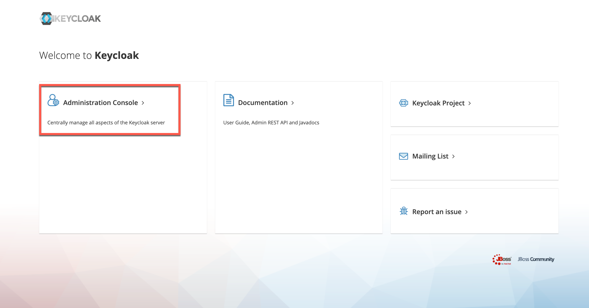
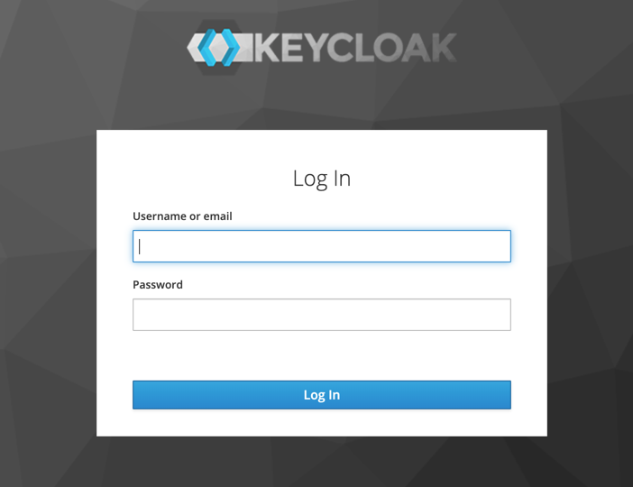
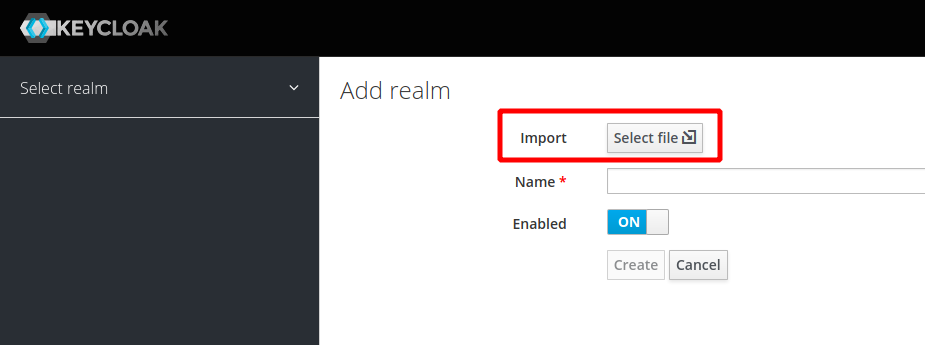

# 4 - Setup Keycloak

These setup instructions are based on [Keycloak - Guide - Keycloak on Kubernetes](https://www.keycloak.org/getting-started/getting-started-kube).

The instructions go into installing an Ingress for Keycloak. But we have Istio installed and we will be using the Istio Ingress to access Keycloak externally. The original `keycloak.yaml` is modified and the `NodePort` has been removed. 

Note: This is a "ephemeral" installation of Keycloak, there is no database used for persistence. Sufficient for a workshop but not suitable for production use!

### Step 1: Deploy Keycloak

```sh
kubectl apply -f keycloak.yaml
```

### Step 2: Wait until the Keycloak Pod is started

```sh
kubectl get pods
```

It takes some time for the pod to start. Notice that there are two containers in the pod, one for Keycloak itself, the other is the Istio Envoy proxy:

```sh
$ kubectl get pod 
NAME                        READY   STATUS    RESTARTS   AGE
keycloak-5c7b8b7c4c-l7j4f   2/2     Running   0          3m6s
```


Continue when both containers are ready.

### Step 3: Access Keycloak

Open the Keycloak URL in your browser:

```sh
https://demo.k8s.local/auth
```

Note: This will work because we created a VirtualService in the previous exercise that maps the '/auth' URI to the Keycloak service.

### Step 4: Try to logon to Keycloak

* Click on 'Administration Console'. 



* Login In with username 'admin' and password 'admin'.



### Step 5: Create realm

For the workshop we need our pre-configured realm. 

In the Keycloak console, hover with your mouse pointer over "Master" in upper left corner. 


Click on the blue "Add realm" button that appears.



Click on "Select file" and import the "quarkus-realm.json" file from the deployments directory.

The name will be "quarkus", the "Create" button will be enabled. Click on "Create".

**Note:** If you stop Minikube (maybe you want to continue tomorrow?) and later start it again, the Keycloak pod will be recreated. Our setup doesn't use a database for persistence, hence the imported realm will be gone and the rest of the sample application will not start since it cannot retrieve data from Keycloak. You will need to repeat Step 5 of these instructions and then wait for the sample app to restart.


### Step 6: Verify the newly created realm

Try to create an access token:

```sh
curl -d "username=alice" -d "password=alice" -d "grant_type=password" -d "client_id=frontend" --insecure https://demo.k8s.local/auth/realms/quarkus/protocol/openid-connect/token  | sed -n 's|.*"access_token":"\([^"]*\)".*|\1|p'
```

---

**Continue with** [5 - Deploy the microservices to Kubernetes](../03-p-sec-exercise/01-README.md)