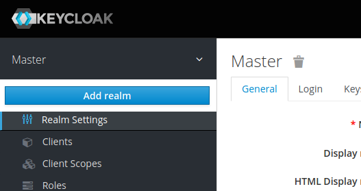

# 4 - Setup Keycloak

These setup instructions are based on [Keycloak - Guide - Keycloak on Kubernetes](https://www.keycloak.org/getting-started/getting-started-kube).

The instructions go into installing an Ingress for Keycloak. But we have Istio installed and we will be using the Istio Ingress to access Keycloak externally. The original `keycloak.yaml` is modified and the `NodePort` has been removed. 

Note: This is a "ephemeral" installation of Keycloak, there is no database used for persistence. Sufficient for a workshop but not suitable for production use!

### Step 1: Deploy Keycloak

```sh
kubectl apply -f keycloak.yaml
```

### Step 2: Wait until the Keycloak Pod is started

```sh
kubectl get pods
```

It takes some time for the pod to start. Notice that there are two containers in the pod, one for Keycloak itself, the other is the Istio Envoy proxy:

```sh
kubectl get pod 

NAME                        READY   STATUS    RESTARTS   AGE
keycloak-5c7b8b7c4c-l7j4f   2/2     Running   0          3m6s
```

Continue when both containers are ready.

### Step 3: Access Keycloak

Open the Keycloak URL in your browser:


[https://demo.k8s.local/auth](https://demo.k8s.local/auth){:target="_blank"}


You will have to accept the security risk in your browser, we are using a self-signed certificate!

Note: This URL will work because we created a VirtualService in the previous exercise that maps the '/auth' URI to the Keycloak service.

### Step 4: Try to logon to Keycloak

* Click on 'Administration Console'. 


* Login In with username 'admin' and password 'admin'.


### Step 5: Create realm

For the workshop we need our pre-configured realm. 

In the Keycloak console, hover with your mouse pointer over "Master" in upper left corner. 



Click on the blue "Add realm" button that appears.


Click on "Select file" and import the "quarkus-realm.json" file from the deployments directory.

The name will be "quarkus", the "Create" button will be enabled. Click on "Create".

**Note:** If you stop Minikube (maybe you want to continue tomorrow?) and later start it again, the Keycloak pod will be recreated. Our setup doesn't use a database for persistence, hence the imported realm will be gone and the rest of the sample application will not start since it cannot retrieve data from Keycloak. You will need to repeat Step 5 of these instructions and then wait for the sample app to restart.


### Step 6: Verify the newly created realm

Try to create an access token:

```sh
curl -d "username=alice" -d "password=alice" -d "grant_type=password" -d "client_id=frontend" --insecure https://demo.k8s.local/auth/realms/quarkus/protocol/openid-connect/token  | sed -n 's|.*"access_token":"\([^"]*\)".*|\1|p'
```

Result looks like this:

```
  % Total    % Received % Xferd  Average Speed   Time    Time     Time  Current
                                 Dload  Upload   Total   Spent    Left  Speed
100  1909  100  1841  100    68   9792    361 --:--:-- --:--:-- --:--:-- 10154
eyJhbGciOiJSUzI1NiIsInR5cCIgOiAiSldUIiwia2lkIiA6ICJjZklBRE5feHhDSm1Wa1d5Ti1QTlhFRXZNVVdzMnI2OEN4dG1oRUROelhVIn0.
eyJleHAiOjE2NzUyNjYwMDIsImlhdCI6MTY3NTI2NTcwMiwianRpIjoiZTVkMDZmNWQtZjkxMS00MTQxLTljOTUtOWVhZWM1ZWRkOGNhIiwiaXN
zIjoiaHR0cHM6Ly9kZW1vLms4cy5sb2NhbC9hdXRoL3JlYWxtcy9xdWFya3VzIiwic3ViIjoiZWI0MTIzYTMtYjcyMi00Nzk4LTlhZjUtODk1N2
Y4MjM2NTdhIiwidHlwIjoiQmVhcmVyIiwiYXpwIjoiZnJvbnRlbmQiLCJzZXNzaW9uX3N0YXRlIjoiMjhjNTVhYTAtZGQwMy00M2RhLTkxNTYtZ
DZlZTNlNWM0ZmQ0IiwiYWNyIjoiMSIsImFsbG93ZWQtb3JpZ2lucyI6WyInKiciLCJodHRwOi8vbG9jYWxob3N0OjgwODAiLCIqIl0sInJlYWxt
X2FjY2VzcyI6eyJyb2xlcyI6WyJ1c2VyIl19LCJzY29wZSI6ImVtYWlsIHByb2ZpbGUiLCJlbWFpbF92ZXJpZmllZCI6ZmFsc2UsInByZWZlcnJ
lZF91c2VybmFtZSI6ImFsaWNlIn0wtoXsUGsqWxa0M2r5kGAntuyWVLAPYlw4yx7xCEyBzlkN6vJOfBzHBed0YQAnOgr9nhsGh9HiX_yyOAvn8e
gPlZJw9SSzLiiHNxIDZU85Jsf01ShUZV9QKXjhLxJ49jDldWNdRCZcnYkT7YXaG7jZIPAb_dN8evxtsHA8d2Xw8VM7PZ_XeyC1q5FP9CsENE5l8
aXFuEVF4pS8rFNhV9RWkT4g0iSku90NEu5EeyjW7rVuEnIHhmjQh9WGOK4o6ICD9nGOuHuCEwPx-oCWtWTYh0ArpkvzfGPBkQkrXlBa8mf6nPs8
bXtTbty6eCDJukf_53pLwVRSVaivU9x0kANw(base)
```

Note: The long block of cryptic text is a Jason Web Token (JWT) for user 'alice' created by Keycloak.

---

**Continue with** [5 - Deploy the microservices to Kubernetes](../03-p-sec-exercise/01-README.md)