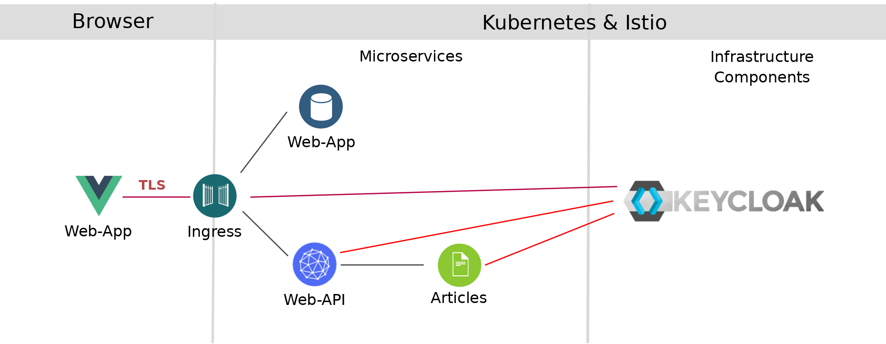
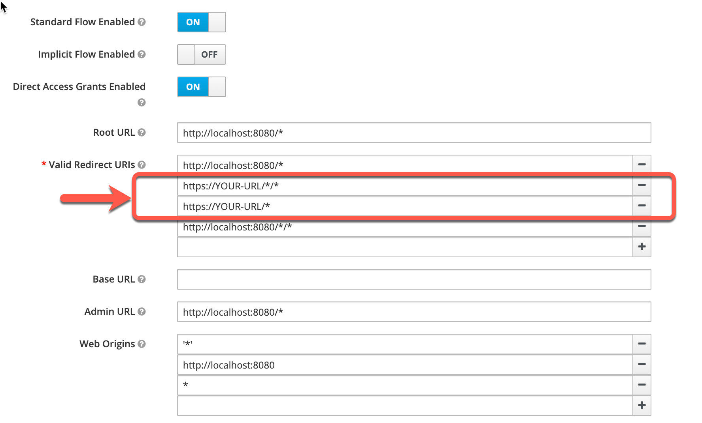

# 5 - Deploy the microservices to Kubernetes

In this exercise we will run the application in your Kubernetes cluster using precompiled container images for our sample application: articles-secure, web-api-secure, and web-app. These container images have been uploaded to [Docker Hub](https://hub.docker.com/u/haraldu){:target="_blank"}.



When running locally, you will set the Keycloak URL as OpenID Connect (OIDC) provider in application.properties. When running on a Kubernetes cluster we cannot set the OIDC provider (keycloak) in application.properties without recompiling the code, building a new image, and loading this image in a Image repository that is accessible to your Kubernetes cluster. So for this example, we specify the Quarkus OIDC property as environment variable during deployment. The environment variable is read from a config map. 

### STEP 1: Apply configmap

This is our configmap definition:

```sh
kind: ConfigMap
apiVersion: v1
metadata:
  name: security-url-config
data:
  QUARKUS_OIDC_AUTH_SERVER_URL: "http://keycloak:8080/auth/realms/quarkus"
```

Our Keycloak service runs in the same namespace as the rest of the application, so all we need is the name of the service (keycloak) and the port numer (8080).

* Apply the `configmap.yaml`

```sh
kubectl apply -f configmap.yaml
```

### STEP 2: Now deploy the 3 services:

* Deploy Articles and Web-API Microservices and the Web-App [Vue.js](https://vuejs.org/) frontend application

    ```sh
    kubectl apply -f articles.yaml
    kubectl apply -f web-api.yaml
    kubectl apply -f web-app.yaml
    ```

* Verify all pods are running

    ```sh
    kubectl get pods
    ```

Example output:

  ```sh
  NAME                        READY   STATUS                       RESTARTS   AGE
  articles-5df77c46b4-v7xcd   2/2     Running                0          3h35m
  keycloak-77cffb978-vjttk    2/2     Running                      0          44h
  web-api-5c9698b875-kz82k    2/2     Running                 0          3h35m
  web-app-659c4676d9-pw6f8    2/2     Running                      0          3h34m
  ```

<!--
### STEP 3: Adjust the redirect, admin, web origins URLs in Keycloak:

* Try to open the Cloud-Native-Starter application in a browser. 

  ```sh
  https://demo.k8s.local
  ```

* You will see we need to configure the redirect in Keycloak

  

* Open Keycloak in a browser and login to Keycloak with `user: admin` and `password: admin`. 
    ```sh
    https://demo.k8s.local/auth/admin/master/console/#/realms/quarkus
    ```

* Select `Clients` and then `frontend` in Keycloak.


* Adjust the Valid Redirect URIs `https://YOUR-URL` with:

    ```sh
    https://demo.k8s.local
    ```

  

### STEP 4: 

--> 

### STEP 3: Open the Cloud Native Starter application in your browser

* Use following URL:

    [https://demo.k8s.local](https://demo.k8s.local){:target="_blank"}
    

* Login in with `user: alice` and `password: alice`

  

* Now you see the entries of the articles

  

If it fails ("Articles could not be read") refresh your browser. (Reason for failure: The articles service creates the list of articles when it is called the first time, this tends to lead to a timeout.)

---

**Continue with** [6 - Secure microservices with strict mTLS](./02-README.md)